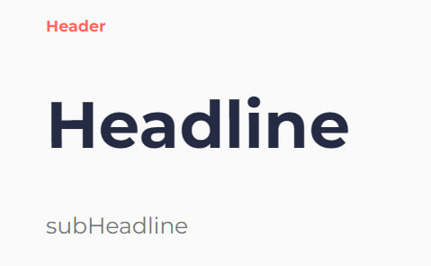

# Showcase and Title

This branch contains components of Showcase and Title

Fully completed showcase and titles

- By [• Просто Кот ᓚᘏᗢ •](https://github.com/meed0ff)

## Title usage

To use Title, firstly import component `Title`

```tsx
import Title from "@/components/Title/Title";
```

and after import, u can finally use it 👍

---

Here is for showcase with big gap (35px) between components, and with big size of `headline`

```tsx
<Title
  types="showcase"
  header="header"
  headline="headline"
  subHeadline="subHeadline"
/>
```

it will look like this



---

if you type `"line"` in `header` prop

```tsx
<Title
  types="showcase"
  header="line"
  headline="Headline"
  subHeadline="SubHeadline"
/>
```

it would look like this


---

```tsx
<Title header="line" headline="Headline" subHeadline="SubHeadline" />
```

And also if you remove `types` prop, it would look like in this photo


gap between components changed to default gap (10px), and `headline`s font size changed also to default size

---

if u want big gap between components with default size of `headline`
just add `normal_headline` with comma after `showcase` in `types` prop


---

Also u can add link

```tsx
<Title
  types="showcase, normal_headline"
  header="line"
  headline="Headline"
  subHeadline="SubHeadline"
  link="/catalog"
/>
```

it will be like in this photo, link will be with text `Learn more >`


